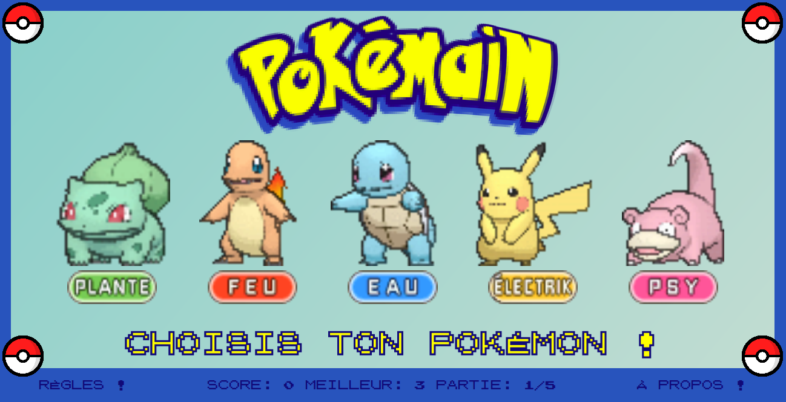

<h1>Pokémain</h1>
<h2>Pierre/Papier/Ciseaux : attrapez-les tous!</h2>

  Projet d'initiation au Javascript, Pokémain offre la possibilité à l'utilisateur de jouer contre l'ordinateur à une version revisitée du Pierre/Papier/Ciseaux, en 5 manches, avec sauvegarde du score en cours et du meilleur score de l'utilisateur. Intuitif, les règles sont détaillées sur un panneau global, avec un rappel au survol de chaque Pokémon.
  <wbr>
  
  <wbr>
  <b>Codes utilisés</b> : HTML, CSS (responsive), Javascript.
   
  <b>En cours</b> : migration vers AngularJS, UX amélioriée.
   
  <b>Perspectives</b> : ajout de mini-jeux supplémentaires à débloquer en fonction du meilleur score acquis.
   
  <a href="https://github.com/paulbhr/pokemain">Code source</a>, <a href="https://paulbhr.github.io/pokemain/">Lien</a>

